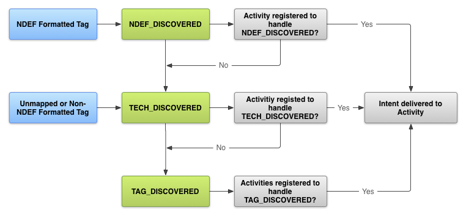
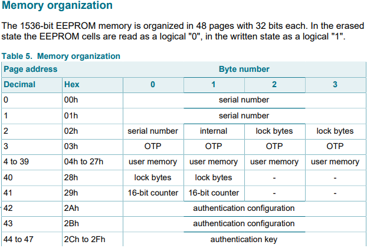

# NFC Component 

## Background Info

#### Terms
- [NDEF (NFC Data Exchange Format)](https://learn.adafruit.com/adafruit-pn532-rfid-nfc/ndef)
- NdefMessage
- NdefRecord: NDEF data is encapsulated inside a message (NdefMessage) that contains one or more records (NdefRecord).
- MIME
- URI


#### Android's Tag Dispatch System does:

1. Parsing the NFC tag and figuring out the MIME type or a URI that identifies the data payload in the tag.
2. Encapsulating the MIME type or URI and the payload into an intent.
3. Starts an activity based on the intent.


#### Permissions

Before you can access a device's NFC hardware and properly handle NFC intents, declare these items in your AndroidManifest.xml file:

```xml
<uses-permission android:name="android.permission.NFC" />
<uses-sdk android:minSdkVersion="10"/>
<uses-feature android:name="android.hardware.nfc" android:required="true" />
```

#### 3-Level Intent Filtering 

1. [ACTION_NDEF_DISCOVERED](https://developer.android.com/reference/android/nfc/NfcAdapter#ACTION_NDEF_DISCOVERED)
2. [ACTION_TECH_DISCOVERED](https://developer.android.com/reference/android/nfc/NfcAdapter#ACTION_TECH_DISCOVERED)
3. [ACTION_TAG_DISCOVERED](https://developer.android.com/reference/android/nfc/NfcAdapter#ACTION_TAG_DISCOVERED)



#### To filter for ACTION_NDEF_DISCOVERED intents

Filter for a specific mimeType

```xml
<intent-filter>
    <action android:name="android.nfc.action.NDEF_DISCOVERED"/>
    <category android:name="android.intent.category.DEFAULT"/>
    <data android:mimeType="text/plain" />
</intent-filter>
```

#### Obtain information from intents

If an activity starts because of an NFC intent, you can obtain information about the scanned NFC tag from the intent.

The following example checks for the ACTION_NDEF_DISCOVERED intent and gets the NDEF messages from an intent extra.

```java
@Override
protected void onNewIntent(Intent intent) {
    super.onNewIntent(intent);
    ...
    if (NfcAdapter.ACTION_NDEF_DISCOVERED.equals(intent.getAction())) {
        Parcelable[] rawMessages = intent.getParcelableArrayExtra(NfcAdapter.EXTRA_NDEF_MESSAGES);
        if (rawMessages != null) {
            NdefMessage[] messages = new NdefMessage[rawMessages.length];
            for (int i = 0; i < rawMessages.length; i++) {
                messages[i] = (NdefMessage) rawMessages[i];
            }
            // Process the messages array.
            ...
        }
    }
}
```

#### AAR for even more specific Filtering 

Introduced in Android 4.0 (API level 14), an Android Application Record (AAR) provides a stronger certainty that your application is started when an NFC tag is scanned. An AAR has the package name of an application embedded inside an NDEF record. You can add an AAR to any NDEF record of your NDEF message, because Android searches the entire NDEF message for AARs. If it finds an AAR, it starts the application based on the package name inside the AAR. If the application is not present on the device, Google Play is launched to download the application.

If a tag contains an AAR, the tag dispatch system dispatches in the following manner:

1. Try to start an Activity using an intent filter as normal. If the Activity that matches the intent also matches the AAR, start the Activity.
2. If the Activity that filters for the intent does not match the AAR, if multiple Activities can handle the intent, or if no Activity handles the intent, start the application specified by the AAR.
3. If no application can start with the AAR, go to Google Play to download the application based on the AAR.


# [Read and Write](https://developer.android.com/guide/topics/connectivity/nfc/advanced-nfc#read-write)

Reading and writing to an NFC tag involves obtaining the tag from the intent and opening communication with the tag. You must define your own protocol stack to read and write data to the tag. 

#### Detection
Step 1: First of all you have to initialize the NFC adapter and define Pending Intent in onCreate callback: 
```java
private NfcAdapter nfcAdapter;
private PendingIntent pendingIntent;


        nfcAdapter = NfcAdapter.getDefaultAdapter((this));
        if (nfcAdapter == null){
            Toast.makeText(this,"NO NFC Capabilities",Toast.LENGTH_SHORT).show();
            finish();
        }
        //Create a PendingIntent object so the Android system can populate it with the details of the tag when it is scanned.
        pendingIntent = PendingIntent.getActivity(this,0,new Intent(this,this.getClass()).addFlags(Intent.FLAG_ACTIVITY_SINGLE_TOP),0);
```
Step 2: onResume() Call back enable the Foreground Dispatch to detect NFC intent. (waiting for NFC card to be tapped)
```java
if (nfcAdapter != null){
    if (!nfcAdapter.isEnabled()){
        //If NFC capable device but NFC not turned on, on users settings
        showBluetoothSettings();
    }
}
//Enables foreground dispatch which handles NFC intents (waiting for NFC card to be tapped)
//The foreground dispatch system allows an activity to intercept an intent and
// claim priority over other activities that handle the same intent.
nfcAdapter.enableForegroundDispatch(this,pendingIntent,null,null);

private void showBluetoothSettings() {
        //Tell user to turn on NFC
        Toast.makeText(this, "You need to enable NFC", Toast.LENGTH_SHORT).show();
        Intent intent = new Intent(Settings.ACTION_BLUETOOTH_SETTINGS);
        startActivity(intent);
}   
```
Step 3: In onPause() callback you have to disable the forground dispatch:
```java 
if (nfcAdapter != null) {
    if (!nfcAdapter.isEnabled()) {
        try {
        nfcAdapter.disableForegroundDispatch(this);
        }
        catch(Exception IllegalStateException) {
            Log.e("NFC", "Error disabling NFC foreground dispatch");
        }
    }
}
```
Step 4: In onNewIntent() call back method, you will get the new Nfc Intent (Card detected)
. After getting The Intent , you have to parse the intent to detect the card: 
Code here for external helper functions. https://github.com/Cawinchan/SnapTrack
```java 
@Override
protected void onNewIntent(Intent intent) {
    super.onNewIntent(intent);
    setIntent(intent);
    resolveIntent(intent);
}

private void resolveIntent(Intent intent) {
    String action = intent.getAction();

    if (NfcAdapter.ACTION_TAG_DISCOVERED.equals(action)
            || NfcAdapter.ACTION_TECH_DISCOVERED.equals(action)
            || NfcAdapter.ACTION_NDEF_DISCOVERED.equals(action)) {
        Parcelable[] rawMsgs = intent.getParcelableArrayExtra(NfcAdapter.EXTRA_NDEF_MESSAGES);
        NdefMessage[] msgs;

        if (rawMsgs != null) {
            msgs = new NdefMessage[rawMsgs.length];

            for (int i = 0; i < rawMsgs.length; i++) {
                msgs[i] = (NdefMessage) rawMsgs[i];
            }

        } else {
            byte[] empty = new byte[0];
            byte[] id = intent.getByteArrayExtra(NfcAdapter.EXTRA_ID);
            Tag tag = (Tag) intent.getParcelableExtra(NfcAdapter.EXTRA_TAG);
            byte[] payload = dumpTagData(tag).getBytes();
            NdefRecord record = new NdefRecord(NdefRecord.TNF_UNKNOWN, empty, id, payload);
            NdefMessage msg = new NdefMessage(new NdefRecord[] {record});
            msgs = new NdefMessage[] {msg};
        }

        displayMsgs(msgs);
    }
}
```
#### Read and write to tags 
Background 



From the Specs of our NFC Tags (https://www.nxp.com/docs/en/data-sheet/MF0ICU2.pdf) 
We can only use the 4th to 39th page address (Each page is 4 btyes thus we have max 140 bytes) 
From an external app extension, it seems like we only have 137 bytes, since each String letter in UTF-8 takes up 1 btye, 
We only have 137 words to work with. (Maybe need to gzip to compress data) 


To read and write we can use this simple guide https://developer.android.com/guide/topics/connectivity/nfc/advanced-nfc#read-write
```java

public class MifareUltralightTagTester {

    private static final String TAG = MifareUltralightTagTester.class.getSimpleName();

    public void writeTag(Tag tag, String tagText) {
        MifareUltralight ultralight = MifareUltralight.get(tag);
        try {
            ultralight.connect();
            ultralight.writePage(4, "abcd".getBytes(Charset.forName("US-ASCII")));
            ultralight.writePage(5, "efgh".getBytes(Charset.forName("US-ASCII")));
            ultralight.writePage(6, "ijkl".getBytes(Charset.forName("US-ASCII")));
            ultralight.writePage(7, "mnop".getBytes(Charset.forName("US-ASCII")));
        } catch (IOException e) {
            Log.e(TAG, "IOException while writing MifareUltralight...", e);
        } finally {
            try {
                ultralight.close();
            } catch (IOException e) {
                Log.e(TAG, "IOException while closing MifareUltralight...", e);
            }
        }
    }

    public String readTag(Tag tag) {
        MifareUltralight mifare = MifareUltralight.get(tag);
        try {
            mifare.connect();
            byte[] payload = mifare.readPages(4);
            return new String(payload, Charset.forName("US-ASCII"));
        } catch (IOException e) {
            Log.e(TAG, "IOException while reading MifareUltralight message...", e);
        } finally {
            if (mifare != null) {
               try {
                   mifare.close();
               }
               catch (IOException e) {
                   Log.e(TAG, "Error closing tag...", e);
               }
            }
        }
        return null;
    }
}
```


 

---

## Reference: 
- [Android Developer Guide - NFC basics](https://developer.android.com/guide/topics/connectivity/nfc/nfc#tag-dispatch)
- [The NFC Data Exchange Format (NDEF)](https://www.dummies.com/consumer-electronics/nfc-data-exchange-format-ndef/)
- [YouTube - Create a NFC Reader Application for Android](https://www.youtube.com/watch?v=TPR2FnrJHz4)
- [YouTube - NFCTutorials](https://www.youtube.com/c/NFCTutorials/videos)
- [GitHub - Simple NFC Reader for Android](https://github.com/nadam/nfc-reader)
