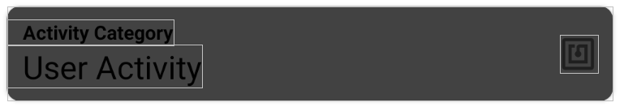

# 1D Project Report - SnapTrack Time Management App (Team 1-1)
SUTD 50.001 Introduction to Information Systems & Programming (2020)

| Name | Student ID |
| :-: | :-: |
| Huang He (Mark) | 1004561 |
| Daniel Low Yu Hian | 1004372 |
| Chan Jun Hern, Cawin | 1004487 |
| Sim Jia Ren | 1004401 |
| Ong Zhi Yi | 1004664 |

---

## Problem Statements

Working adults are finding it harder to separate between work and life. Similarly, students are finding it harder to partition time for studies and leisure. We hope to empower our users to make smarter time management choices by providing an all-encompassing, no-nonsense companion, to encourage them to compartmentalize their life and re-find their centre.

## Our Solution 

An NFC-enabled mobile application that tracks your time spent on different activities
effortlessly with a simple tap. With our intuitive data analytics and visualization, users can easily review past time investments and make future time management goals.

## Main Features 

- General
    - User sign up and sign in
    - NFC tag tapping to start / end `Event`
- Today Page 
    - Today Timeline Overview
    - User manually start / end `Event`
- Activities Page
    - User create `UserActivity`
    - User link NFC tag to UserActivity
- Analytics Page
    - Daily Overview for the past week
- Me Page
    - User sign out
    - User reset account
- For Development Testing and Demo
    - Dev Button: Add dummy UserActivities
    - Dev Button: Add dummy tracked Events

## System Design and Architecture


### Key Custom Java Classes 

**User**

Attributes: 
- `string` authID: generated and maintained by Firebase Authentication.
- `string` userID: App generated (specifically) 16-char unique ID.
- `string` userName: user’s name for display 
- `string` email: maintained by Firebase Authentication
- `string` password: maintained by Firebase Authentication

**UserActivity** 

`UserActivity` is the user-defined activity (e.g. "Work out", "Study", "CompStruct", "Entertainment", etc) for time tracking.

Attributes: 
- `string` AID: stands for Activity ID, also App generated (specifically) 16-char.
- `string` activityName: name of the user-defined activity, must be unique.
- `int` color: color that ties to this user-defined activity for UI display.
- `string` category: the category of this user-defined activity.

**Category** 

`Category` is used to group `UserActivity`.

Attributes: 
- `string` name: name of the category.
- `int` color: color that ties to this category for UI display.


**Event** 

`Event` is the object being created when a ‘User’ starts doing a `UserActivity`, either using NFC tapping or manual creation. 

Attributes: 
- `string` EID: stands for Event ID, randomly generated unique ID.
- `string` userID: current User’s userID.
- `string` AID: current tracking `UserActivity` AID.
- `long` timeStart: start time of this event.
- `long` timeEnd: end time of this event. 

### Design Patterns

#### RecyclerView (Adapter Design Pattern)

*Objective*: 

In our application, users can define their own list of `UserActivities`, so we need a dynamic list view to show different `UserActivities` to different users. 


*Implementation Details*:

- Each `UserActivity` is presented to user as a `androidx.cardview.widget.CardView` as shown below:



- This `CardView` serves as a template for items in my `androidx.recyclerview.widget.RecyclerView`.
- Using Adapter, we can adapt an ArrayList of `UserActivities` into a list of `CardView` which populates the `RecyclerView`.
    ```java
    public class ActivitiesAdapter extends RecyclerView.Adapter<ActivitiesAdapter.ActivityViewHolder> {
        ArrayList<UserActivityInfo> mActivityList;
        // ...
        @Override
        public void onBindViewHolder(@NonNull ActivityViewHolder holder, int position) {
            UserActivityInfo currentItem = mActivityList.get(position);
            // set name 
            holder.aTextView.setText(currentItem.getActivityName());
            // set category
            holder.cTextView.setText(currentItem.getCategory());
            // set color 
            holder.mCardView.setCardBackgroundColor(currentItem.getColor());
            // set onClick action
            holder.mCardView.setOnClickListener(new View.OnClickListener() {
                @Override
                public void onClick(View v) {
                    // ...
                }
            });
        }
    }
    ```
- Result Screenshot:

    

#### Comparable Interface

*Objective*: 

At the first page (Today page) of our application, users can view `Events` tracked for today in a timeline view, the height of each `Event` block should reflects the duration of the `Event`, and the list of events should be sorted in reverse chronological order.


*Implementation Details*:

- Firstly, the list of events cards is achieved using `RecyclerView` and `CardView` as well.
- We implemented the Comparable Interface for `Event` such that we can sort the list of events in an ArrayList before pass it to the RecyclerView Adapter.

    ```java
    public class EventInfo implements Comparable<EventInfo>{
        // ...
        @Override
        public int compareTo(EventInfo o) {
            if (this.start_time < o.start_time) return -1;
            else if (this.start_time > o.start_time) return 1;
            return 0;
        }
    }
    ```

    ```java
    ArrayList eventList = new ArrayList<>(events);
    Collections.sort(eventList);
    Collections.reverse(eventList);
    ```
- Dynamic height of CardView is achieved by modifying `CardView`'s `LayoutParams` based on Event duration. Minimum height is set to ensure proper display of information.

    ```java
    public class EventsAdapter  extends RecyclerView.Adapter<EventsAdapter.EventViewHolder>{
        ArrayList<EventInfo> eventList;
        // ...
        @Override
        public void onBindViewHolder(@NonNull EventViewHolder holder, int position) {
            EventInfo currentItem = eventList.get(position);
            holder.activityTextView.setText(currentItem.getUserActivityName());
            holder.startTimeTextView.setText(currentItem.getStartTimeAsString());
            holder.durationTextView.setText(
                String.valueOf(currentItem.getDurationString())
                );

            // set card height according to Event duration
            int heightValue = (int) currentItem.getDurationSeconds() / 36;
            if (heightValue < 50) heightValue = 50;
            ViewGroup.LayoutParams params = holder.mCardView.getLayoutParams();
            params.height = heightValue;
            holder.mCardView.setLayoutParams(params);

            // set card color according to activity color
            holder.mCardView.setCardBackgroundColor(currentItem.getUserActivityColor());

        }
    }
    ```

#### Fragments Navigation 

*Objective:*

We have 4 top-level navigation destinations, namely `Today` , `Activities`, `Analytics`, and `Me`. According to [Material Design Principal](https://material.io/components/bottom-navigation), App with three to five top-level destinations should use bottom navigation bar instead of side navigation panel.


*Implementation Details:*

We decided to use fragments to achieve the navigation. So, at mainActivity Layout, we have a `BottomNavigationView` at the bottom to serve as the navigation bar. The rest of the screen space is filled with a `fragment` to serve as a fragment-holder / fragment-host. This fragment-host will be the parent of all fragments holding each different app pages.


#### Model–View–ViewModel (MVVM) Design Pattern

*Objective:*

To separate the backend data handling and the frontend UI handling. Making the project much more structured and clean.


*Implementation Details:*

- Each page has a `ViewModel` which handles data for this page. For example: `MeViewModel.java`
    ```java
    public class MeViewModel extends ViewModel {
        // ... 
    }
    ```
- Each page has a View Controller made of `fragment` with its corresponding `Layout` file in `XML`. For example: `MeFragment.java`
    ```java
    public class MeFragment extends Fragment {
        // ...
        @Override
        public void onActivityCreated(@Nullable Bundle savedInstanceState) {
        super.onActivityCreated(savedInstanceState);
        // Get the View Model
        meViewModel = new ViewModelProvider(this).get(MeViewModel.class);
        // ...

        }
    }
    ```


#### Realtime Data Binding using MutableLiveData

*Objective:*

- To establish data linkage between View Controller and View Model. 
- To establish realtime data synchronization between Firebase database and User-end UI. 
- To optimize for performance, update UI only when data changes.

*Implementation Details:*


- At View Controller, asynchronous listener is set to listen to changes on `MutableLiveData` object from `ViewModel`. For example, we use `MutableLiveData` to contain the list of `Events`:
    ```java
    MutableLiveData<ArrayList<EventInfo>> eventListLive;
    ```
- At `ViewModel`, we set asynchronous database listeners. 
- Data is retrieved from database using our Data Model
- Data is then put to `MutableLiveData`
- At View Controller, UI elements get updated due to `OnChange` listener being triggered.


#### Analytics

For analytics page, we made use of an external library: [MPAndroidChart](https://github.com/PhilJay/MPAndroidChart).

#### NFC Read / Write

- We defined our own NFC info schema to store user activity on an NFC tag. 
- We defined our own NFC signature to double-check data validity.  
- For detailed technical description of NFC implementation, please refer to another document [here](https://github.com/MarkHershey/SnapTrack/blob/master/Docs/NFC.md).


## User Flow

### App Screenshots

| Tracking | Create Activity |  Analytics |  Me |
| :-: | :-: | :-: | :-: |
|  |  |  |  |

### User Journey

1. Create Personal Activities
2. Pair NFC to activity 
    - Activities screen → Create activity → Select Activity → Pair NFC
3. Start activity tracking 
    - Manual
        - Today Screen → Press Floating button → Choose created activity → Start activity tracking 
    - NFC Tapping 
        - Tap NFC → NFC starts timer for paired Activity 
4. Stop activity tracking 
    - Manual 
        - Press STOP TIMER
    - Automatic
        - Scan NFC Again

## Source Code

Source code is available at [GitHub - MarkHershey / SnapTrack](https://github.com/MarkHershey/SnapTrack).

## Project Responsibilities

| Name | Student ID | Responsibilities |
| :-: | :-: | :-: |
| Huang He (Mark) | 1004561 | Lead Developer, Feature ideation, System Architecture Design, Integration and more. |
| Daniel Low Yu Hian | 1004372 | Software Developer, Data Model Implementation, Database Design, Data Utilities and more. |
| Chan Jun Hern, Cawin | 1004487 | Software Developer, Implementation of NFC Functionalities (Reading / Writing / Pairing), App Testing and more. |
| Sim Jia Ren | 1004401 | Software Developer, Feature ideation, UI Implementations, Today Page and more. |
| Ong Zhi Yi | 1004664 | Software Developer, Feature ideation, UI Implementations, Analytics Page and more. |


##  Future Work

- The current analytics page is very limited, what we could do in the future is to provide more advanced analytics based on user selection and filtering. We can also derive insights, suggestions from the data we collected, and present those insights to our user.
- To allow user setting categorical or activity-based time goals. Assist user in achieving their goals.
- To allow user backup/ download data. 
- UI/ UX Improvements. 

## Conclusion

The development journey was very fruitful, we have learned various software design patterns and why do we need them, we have also encountered many problems along the way, but we managed to solve most of them. We have gained a great amount of practical development knowledge and experiences, and the end result is a fully functional mobile application that all of us are proud and satisfied. Even though the app is far from perfect and complete, but we also learned how to balance and prioritize during software development. 