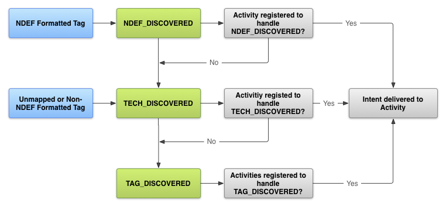

# NFC Component 

## Background Info

#### Terms
- [NDEF (NFC Data Exchange Format)](https://learn.adafruit.com/adafruit-pn532-rfid-nfc/ndef)
- NdefMessage
- NdefRecord: NDEF data is encapsulated inside a message (NdefMessage) that contains one or more records (NdefRecord).
- MIME
- URI


#### Android's Tag Dispatch System does:

1. Parsing the NFC tag and figuring out the MIME type or a URI that identifies the data payload in the tag.
2. Encapsulating the MIME type or URI and the payload into an intent.
3. Starts an activity based on the intent.


#### Permissions

Before you can access a device's NFC hardware and properly handle NFC intents, declare these items in your AndroidManifest.xml file:

```xml
<uses-permission android:name="android.permission.NFC" />
<uses-sdk android:minSdkVersion="10"/>
<uses-feature android:name="android.hardware.nfc" android:required="true" />
```

#### 3-Level Intent Filtering 

1. [ACTION_NDEF_DISCOVERED](https://developer.android.com/reference/android/nfc/NfcAdapter#ACTION_NDEF_DISCOVERED)
2. [ACTION_TECH_DISCOVERED](https://developer.android.com/reference/android/nfc/NfcAdapter#ACTION_TECH_DISCOVERED)
3. [ACTION_TAG_DISCOVERED](https://developer.android.com/reference/android/nfc/NfcAdapter#ACTION_TAG_DISCOVERED)



#### To filter for ACTION_NDEF_DISCOVERED intents

Filter for a specific mimeType

```xml
<intent-filter>
    <action android:name="android.nfc.action.NDEF_DISCOVERED"/>
    <category android:name="android.intent.category.DEFAULT"/>
    <data android:mimeType="text/plain" />
</intent-filter>
```

#### Obtain information from intents

If an activity starts because of an NFC intent, you can obtain information about the scanned NFC tag from the intent.

The following example checks for the ACTION_NDEF_DISCOVERED intent and gets the NDEF messages from an intent extra.

```java
@Override
protected void onNewIntent(Intent intent) {
    super.onNewIntent(intent);
    ...
    if (NfcAdapter.ACTION_NDEF_DISCOVERED.equals(intent.getAction())) {
        Parcelable[] rawMessages = intent.getParcelableArrayExtra(NfcAdapter.EXTRA_NDEF_MESSAGES);
        if (rawMessages != null) {
            NdefMessage[] messages = new NdefMessage[rawMessages.length];
            for (int i = 0; i < rawMessages.length; i++) {
                messages[i] = (NdefMessage) rawMessages[i];
            }
            // Process the messages array.
            ...
        }
    }
}
```

#### AAR for even more specific Filtering 

Introduced in Android 4.0 (API level 14), an Android Application Record (AAR) provides a stronger certainty that your application is started when an NFC tag is scanned. An AAR has the package name of an application embedded inside an NDEF record. You can add an AAR to any NDEF record of your NDEF message, because Android searches the entire NDEF message for AARs. If it finds an AAR, it starts the application based on the package name inside the AAR. If the application is not present on the device, Google Play is launched to download the application.

If a tag contains an AAR, the tag dispatch system dispatches in the following manner:

1. Try to start an Activity using an intent filter as normal. If the Activity that matches the intent also matches the AAR, start the Activity.
2. If the Activity that filters for the intent does not match the AAR, if multiple Activities can handle the intent, or if no Activity handles the intent, start the application specified by the AAR.
3. If no application can start with the AAR, go to Google Play to download the application based on the AAR.


#### [Read and Write](https://developer.android.com/guide/topics/connectivity/nfc/advanced-nfc#read-write)

Reading and writing to an NFC tag involves obtaining the tag from the intent and opening communication with the tag. You must define your own protocol stack to read and write data to the tag. 


---

## Reference: 
- [Android Developer Guide - NFC basics](https://developer.android.com/guide/topics/connectivity/nfc/nfc#tag-dispatch)
- [The NFC Data Exchange Format (NDEF)](https://www.dummies.com/consumer-electronics/nfc-data-exchange-format-ndef/)
- [YouTube - Create a NFC Reader Application for Android](https://www.youtube.com/watch?v=TPR2FnrJHz4)
- [YouTube - NFCTutorials](https://www.youtube.com/c/NFCTutorials/videos)
- [GitHub - Simple NFC Reader for Android](https://github.com/nadam/nfc-reader)
