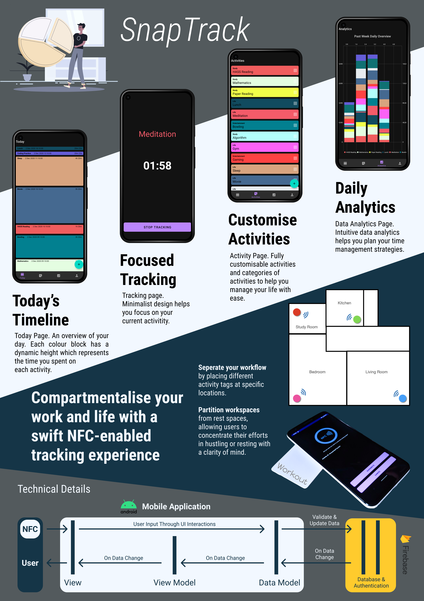

# SnapTrack

SnapTrack is an NFC-enabled mobile application that tracks your time spent on different activities effortlessly with a simple tap.

# Developers 

- [Mark Huang @MarkHershey](https://github.com/MarkHershey)
- [Daniel Low @nexaitch](https://github.com/nexaitch)
- [Cawin Chan @Cawinchan](https://github.com/Cawinchan)
- [Sim Jia Ren @amelia-jr](https://github.com/amelia-jr)
- [Ong Zhi Yi @miyucloud](https://github.com/miyucloud)

# Disclaimers 

- [MIT License](LICENSE) Copyright (c) 2020
- This project will not be maintained / serviced. 
- This application is developed to fulfill the course requirement of SUTD 50.001 Introduction to Information Systems & Programming (2020). 